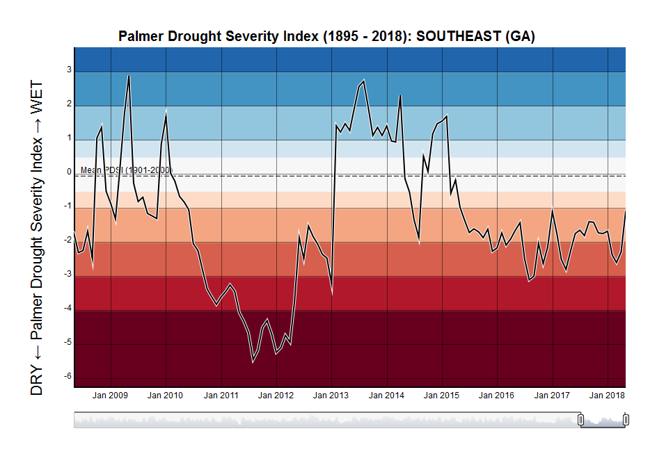
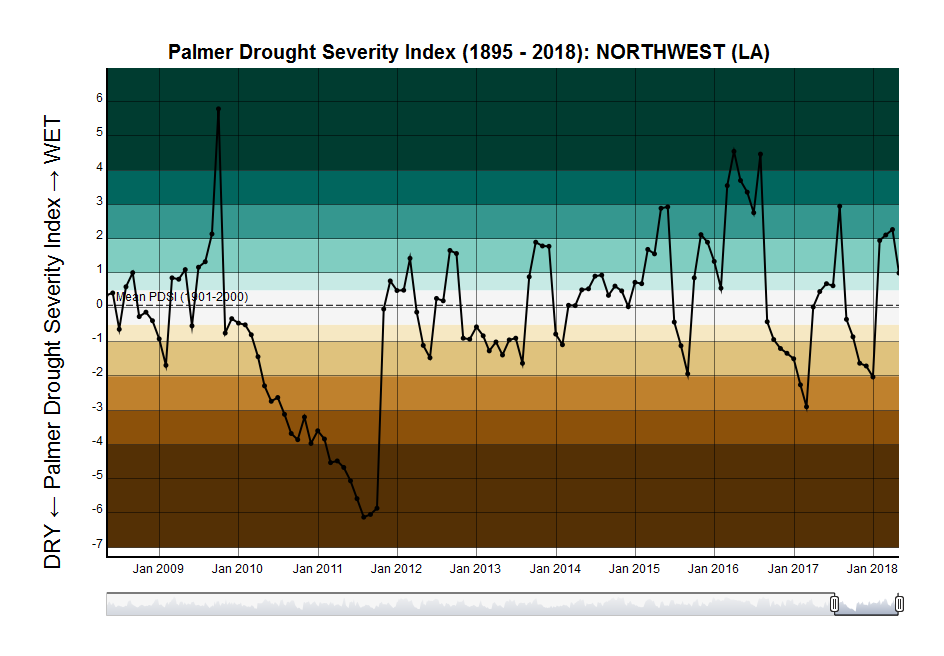

[](https://travis-ci.org/adamdsmith/pdsi)

USFWS Disclaimer
================

This United States Fish & Wildlife Service (USFWS) code is provided on an "as is" basis and the user assumes responsibility for its use. USFWS has relinquished control of the information and no longer has responsibility to protect the integrity , confidentiality, or availability of the information. Any reference to specific commercial products, processes, or services by service mark, trademark, manufacturer, or otherwise, does not constitute or imply their endorsement, recomendation or favoring by USFWS. The USFWS seal and logo shall not be used in any manner to imply endorsement of any commercial product or activity by USFWS or the United States Government.

Installing `pdsi`
=================

The `pdsi` package requires you to have [R](https://www.r-project.org/) (&gt;= 3.3) installed on your computer as well as [Rtools](https://cran.r-project.org/bin/windows/Rtools/). Both will require administrative priveleges but the installation of packages after this initial install will not.

With R and Rtools installed, it's simple to install and load the `pdsi` package to access its functionality.

    # If devtools package is not installed
    install.packages("devtools", dependencies = TRUE)

    # Now install and load pdsi
    devtools::install_github("adamdsmith/pdsi")
    library("pdsi")

The `pdsi` package
==================

The primary purpose of the package is to generate an interactive plot of monthly Palmer Drought Severity Index values for a given location, provided as a lat/lon pair or an address.

Using an address is probably easier, but subject to query limits from the Google API.

``` r
# Okefenokee NWR
pdsi_plot(address = "okefenokee nwr")
```



Using latitude and longitude, you can avoid API issues...

``` r
# Red River NWR
pdsi_plot(32.44757, -93.671768, fill = "BrBG", halo = FALSE)
```



There are a few display options you can choose among. See the help file `?pdsi_plot` for a description.
